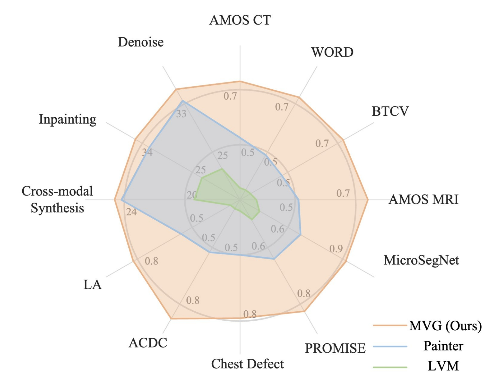
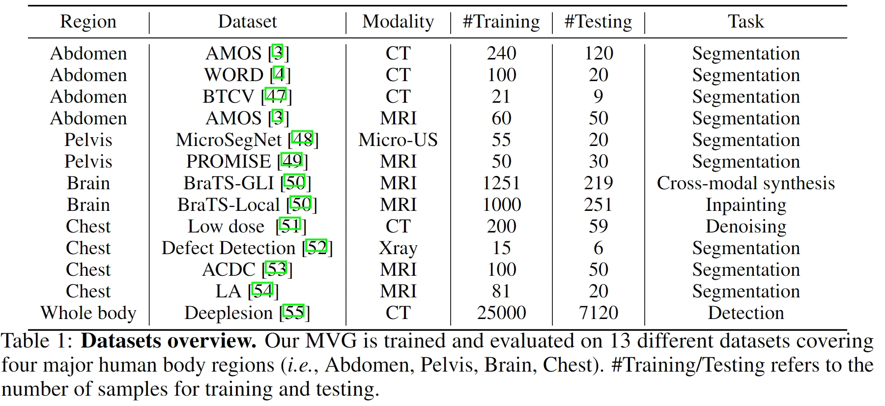

# MVG
This repository is the implementation of [Medical Vision Generalist: Unifying Medical Imaging Tasks in Context ](https://arxiv.org/abs/2406.05565)


## Introduction
We show that in-context generation strategy enables a flexible unification of various tasks, even those spanning different modalities and datasets. 

We present Medical Vision Generalist (MVG), the first foundation model capable of handling various medical imaging tasks---such as cross-modal synthesis, image segmentation, denoising, and inpainting---within a unified image-to-image generation framework. By treating these tasks as an image generation process conditioned on prompt image-label pairs and input images, this approach enables a flexible unification of various tasks, even those spanning different modalities and datasets.

To capitalize on both local and global context, we design a hybrid method combining masked image modeling with autoregressive training for conditional image generation. This hybrid approach yields the most robust performance across all involved medical imaging tasks. We also curate the first comprehensive generalist medical vision benchmark, comprising 13 datasets and spanning four imaging modalities (CT, MRI, X-ray, and micro-ultrasound). MVG exhibits strong scalability, with its performance demonstrably improving when trained on a more diverse set of tasks, and can be effectively adapted to unseen datasets with only minimal task-specific samples.




## Dataset Preparation

We train our MVG on 8 segmentation dataset: 
+ [AMOS CT](https://amos22.grand-challenge.org/)
+ [WORD](https://github.com/HiLab-git/WORD)
+ [BTCV](https://www.synapse.org/Synapse:syn3193805/wiki/217789)
+ [AMOS MRI](https://arxiv.org/pdf/2401.04722.pdf)
+ [MicroSegNet](https://github.com/mirthAI/MicroSegNet)
+ [PROMISE](https://promise12.grand-challenge.org/Details/)
+ [Defect Dection](https://pubmed.ncbi.nlm.nih.gov/30730032/)
+ [ACDC](https://www.kaggle.com/datasets/mohamedhedidjemaa/dataset-from-the-miccai-challenge-2017)
+ [LA](https://github.com/yulequan/UA-MT)

Cross modal synthesis:
+ [BraTS-GLI](https://www.synapse.org/Synapse:syn51156910/files/)

Inpainting:
+ [BraTS-Local](https://www.synapse.org/Synapse:syn51156910/files/)

Denoise:
+ [Low dose](https://pubmed.ncbi.nlm.nih.gov/33202055/)

We split the 3D volumes into 2D frames and keep the frame if it contains foreground.

## Training
```
torchrun --nproc_per_node=8 --master_port 1221 main_pretrain.py \
    --batch_size 16 \
    --model mvg_vit_large_patch16 \
    --mask_ratio 0.75 \
    --epochs 100 \
    --warmup_epochs 5 \
    --lr 1e-3 --weight_decay 0.05 \
    --num_mask_patches 256 --half_mask_ratio 1.0 \
    --max_mask_patches_per_block 128 \
    --min_mask_patches_per_block 16 \
    --input_size 896 448 \
    --data_path /path/to/MVGDataSet/train/\
     --finetune /path/to/mae_pretrain_vit_large.pth
```


## ✍ Citation
```
@article{ren2024medical,
  title={Medical Vision Generalist: Unifying Medical Imaging Tasks in Context},
  author={Ren, Sucheng and Huang, Xiaoke and Li, Xianhang and Xiao, Junfei and Mei, Jieru and Wang, Zeyu and Yuille, Alan and Zhou, Yuyin},
  journal={arXiv preprint arXiv:2406.05565},
  year={2024}
}
```
If you have any question, feel free to contact [Sucheng Ren](https://oliverrensu.github.io/) :)
