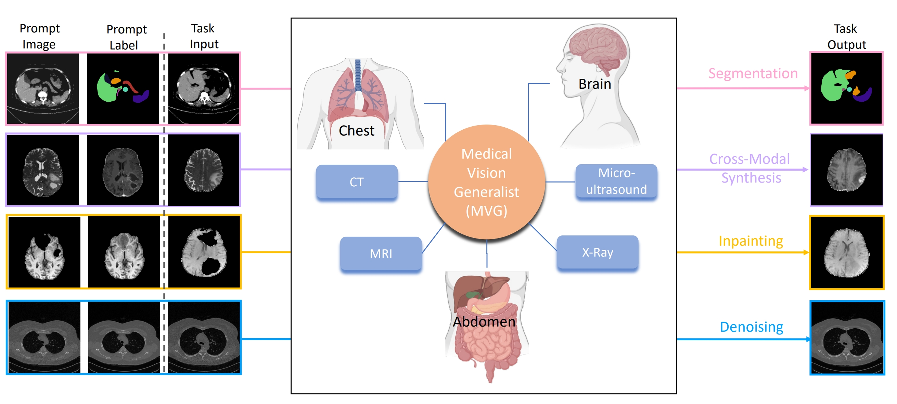

# MVG
This repository is the implementation of [Medical Vision Generalist: Unifying Medical Imaging Tasks in Context ](https://arxiv.org/abs/2406.05565)

## Introduction
> This study presents Medical Vision Generalist (MVG), the first foundation model capable of handling various medical imaging tasks -- such as cross-modal synthesis, image segmentation, denoising, and inpainting -- within a unified image-to-image generation framework. Specifically, MVG employs an in-context generation strategy that standardizes the handling of inputs and outputs as images. By treating these tasks as an image generation process conditioned on prompt image-label pairs and input images, this approach enables a flexible unification of various tasks, even those spanning different modalities and datasets. To capitalize on both local and global context, we design a hybrid method combining masked image modeling with autoregressive training for conditional image generation. This hybrid approach yields the most robust performance across all involved medical imaging tasks. To rigorously evaluate MVG's capabilities, we curated the first comprehensive generalist medical vision benchmark, comprising 13 datasets and spanning four imaging modalities (CT, MRI, X-ray, and micro-ultrasound). Our results consistently establish MVG's superior performance, outperforming existing vision generalists, such as Painter and LVM. Furthermore, MVG exhibits strong scalability, with its performance demonstrably improving when trained on a more diverse set of tasks, and can be effectively adapted to unseen datasets with only minimal task-specific samples.

